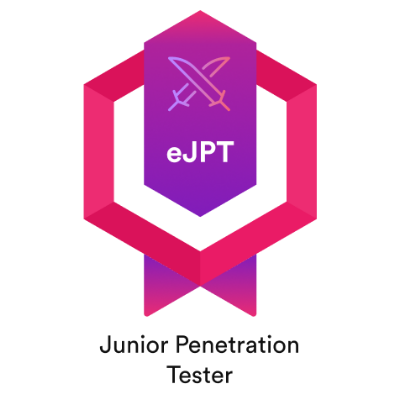

# Hello, I'm Héctor

I am a cybersecurity enthusiast focused on red team doing personal security projects and offensive labs.

## Objective
My journey into cibersecurity started the moment I entered the world of IT. I initially focused on system administration, but I soon realized that my true passion lies in cibersecurity, specifically within red team.
## Skills

| Skill                                 | Associated Project                                |
| ------------------------------------- | ------------------------------------------------- |
| Offensive AD laboratory (in progress) | <a href="https://github.com/Hector423/AD-Security-Assessment-Lab.git">AD Lab</a> |

## Tools

### Network & Pentesting

    
	
	

### Web Application Security

	

## Certifications

## Projects
- AD Lab
- <a href="https://github.com/Hector423/Automatic_background_Linux.git">Automatic background changer</a>
